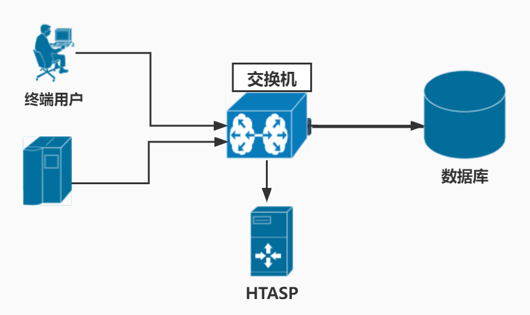

        

# 海天数据库安全审计防护平台

  

#### 简介
HTASP（HThorizon Audit Security Protection ）是一款实时具备实时主动防护能力的数据库安全审计类产品。

#### 公司信息

#### 部署方式
######  1. 基于反向代理的串联式部署模式

        

######  2. 基于端口镜像的旁路监听部署模式

        

#### 支持的数据库
1. oracle
2. mysql
3. postgresql
4. 达梦
5. 神州通用
6. todo...
